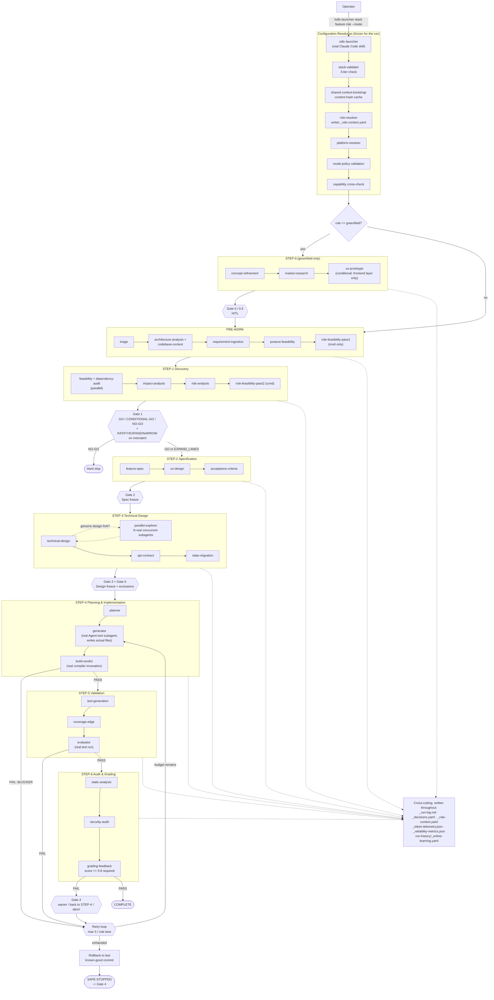

# AI-SDLC Framework — Complete Flow & Requirements Compliance

This document has two parts: (1) the complete end-to-end flow of the
framework, with a full architecture/flow diagram, and (2) a
requirement-by-requirement mapping showing how this project satisfies
every term of the assignment ("Interview Assignment: Build an Agentic
Software Engineering System — URL Shortener"), backed by evidence
from the three actually-completed runs, not just design intent. For
the framework's static structure (components, agent/skill/rule
separation, key design decisions) see
[`docs/architecture-overview.md`](architecture-overview.md) instead.

---

## Part 1: Complete Flow

### 1.1 Entry and Configuration Resolution

Every run starts the same way, regardless of scenario:

```
/sdlc-launcher <stack> <feature-id> [role] [--mode=deterministic|hybrid|agentic] [--platform=none|aws|gcp|azure]
```

This is a real, registered Claude Code skill
(`.claude/skills/sdlc-launcher/SKILL.md`) — typing it triggers actual
execution, not a documented convention. The launcher resolves and
freezes four configuration axes for the entire run (mid-run change of
any axis is forbidden, `rules/mode-policy.md`):

| Axis | Answers | This project's values |
|---|---|---|
| **Stack** | What technology? | `java-spring` (Spring Boot 3.1.4 / Java 19) |
| **Role** | What scope? | `greenfield` \| `services-mod` \| `services-doc` |
| **Mode** | How autonomous? | `agentic` (project default) \| `hybrid` \| `deterministic` |
| **Platform** | What cloud overlay? | `none` (no overlay needed for this scope) |

Resolution sequence (all logged to `_run-log.md` per run):
1. **Parse arguments**
2. **`stack-validator`** — 3-tier check (manifest exists → references resolve → no deprecated reference drift)
3. **`shared-context-bootstrap`** — content-hash-keyed cache of architecture/codebase analysis (cache hit reuses a snapshot; a cache miss, as happened on every brownfield/ambiguous run once real code existed, triggers genuine re-analysis)
4. **`role-resolver`** — loads the role manifest, resolves `quality_policies` and gate thresholds, writes `_role-context.yaml`
5. **`platform-resolver`** — resolves the (here, empty) platform overlay
6. **Mode validation** — confirms the bounded-autonomy ceiling for the chosen mode
7. **Capability cross-check** — every agent's declared `Requires` is checked against what the stack manifest actually provides; the run aborts at launch, not mid-flight, if anything can't be satisfied

### 1.2 Entry Phase Decision

- `role=greenfield` → enter at **STEP-0** (concept → prototype)
- Any other role → enter at **PRE-WORK** directly, with real codebase
  reasoning (not a clean-slate assumption)
- An ambiguous/thin requirement is **not** a separate code path — it's
  the same PRE-WORK entry, where `posture-feasibility`/`triage` are
  expected to surface a mismatch rather than a clean pass

### 1.3 The Phase Pipeline

| Phase | Purpose | Key agents | Gate(s) |
|---|---|---|---|
| STEP-0 *(greenfield only)* | Concept → prototype | `concept-refinement`, `market-research`, `ux-prototype` *(conditional — only if the stack declares a `frontend` layer; never fires for this API-only project)* | 0, 0.5 *(0.5 conditional on ux-prototype firing)* |
| PRE-WORK | Establish the immutable context every phase reads | `triage`, `code-graph-bootstrap`, `architecture-analysis`, `codebase-context`, `requirement-ingestion`, `posture-feasibility`, `role-feasibility-pass1` *(mod only)* | — |
| STEP-1 Discovery | Is this feasible? What's the risk? | `feasibility` + `dependency-audit` (parallel) → `impact-analysis` → `risk-analysis` → `role-feasibility-pass2` *(cond)* → `git-history-capture` *(cond)* | 1 *(extends with RATIFY/EXPAND_LANES/NARROW_LANES/NO-GO on a role mismatch)* |
| STEP-2 Specification | Define WHAT | `feature-spec`, `ux-design`, `acceptance-criteria` | 2 |
| STEP-3 Technical Design | Define HOW | `technical-design` *(optionally forking into `parallel-explorer` for genuine design alternatives)*, `api-contract`, `refactor-migration` *(cond)*, `state-migration` | 3, 6 *(5, 7 conditional, not triggered in this project's runs)* |
| STEP-4 Planning & Implementation | Plan, generate, verify it compiles | `planner`, `generator`, `build-verdict` (STEP-4.1) | — |
| *(retry loop, max 5/role lane)* | STEP-4 ⇄ STEP-5 ⇄ STEP-6 | — | — |
| STEP-5 Validation | Verify the code works | `test-generation`, `coverage-edge`, `evaluator` | — |
| STEP-6 Audit & Grading | Final quality gate | `static-analysis`, `security-audit`, `grading-feedback` | 4 *(only on a STEP-6 FAIL)* |

PASS at STEP-6 → **COMPLETE**. Retry-budget exhaustion → **rollback +
SAFE-STOPPED**, surfaced at Gate 4 (`rules/retry-rollback-safestop.md`).

### 1.4 Architecture / Flow Diagram

The diagram below is plain text (box-drawing characters in a fenced
code block), so it renders correctly in **any** markdown viewer —
IntelliJ's preview, a plain-text editor, GitHub, VS Code — with no
dependency on Mermaid support. Every box names the phase, states what
it actually does, and lists the exact agents/skills dispatched for it.

```text
┌────────────────────────────────────────────────────────────────────────────────────────────────┐
│                                            OPERATOR                                            │
├────────────────────────────────────────────────────────────────────────────────────────────────┤
│      /sdlc-launcher <stack> <feature-id> [role] [--mode=det|hybrid|agentic] [--platform]       │
└────────────────────────────────────────────────────────────────────────────────────────────────┘
                                          │
                                          ▼
┌────────────────────────────────────────────────────────────────────────────────────────────────┐
│ CONFIG RESOLUTION  (all 4 axes frozen for the whole run (rules/mode-policy.md))                │
├────────────────────────────────────────────────────────────────────────────────────────────────┤
│ WHAT IT DOES: locks stack/role/mode/platform before any phase runs; verifies the run CAN       │
│ actually be satisfied end to end, so a bad config fails at launch, not mid-flight.             │
│                                                                                                │
│ SKILLS USED (in order): stack-validator -> shared-context-bootstrap -> role-resolver ->        │
│ platform-resolver -> mode-policy validation -> capability cross-check                          │
└────────────────────────────────────────────────────────────────────────────────────────────────┘
                                          │
                              role == greenfield ?
                     ┌────────── yes ─────┴───── no ──────────┐
                     ▼                                       ▼
┌────────────────────────────────────────────────────────────────────────────────────────────────┐
│ STEP-0  (greenfield only)                                                                      │
├────────────────────────────────────────────────────────────────────────────────────────────────┤
│ WHAT IT DOES: turns a raw idea into a scoped concept, sanity-checks it against the market, and │
│ (only if the stack has a UI layer) sketches a prototype.                                       │
│                                                                                                │
│ AGENTS USED: concept-refinement, market-research, ux-prototype (*conditional on a declared     │
│ frontend layer -- never fires for this API-only project*)                                      │
└────────────────────────────────────────────────────────────────────────────────────────────────┘
                     │  Gate 0 / 0.5 (HITL)                              │
                     └──────────────────────┬────────────────────────────┘
                                             ▼
┌────────────────────────────────────────────────────────────────────────────────────────────────┐
│ PRE-WORK                                                                                       │
├────────────────────────────────────────────────────────────────────────────────────────────────┤
│ WHAT IT DOES: establishes the ground truth every later phase reads -- reads the REAL codebase  │
│ (never assumed), normalizes the raw ask into a clear engineering problem, and checks the filed │
│ posture actually matches what is being asked.                                                  │
│                                                                                                │
│ AGENTS USED: triage, code-graph-bootstrap, architecture-analysis, codebase-context,            │
│ requirement-ingestion, posture-feasibility, role-feasibility-pass1 (mod only)                  │
└────────────────────────────────────────────────────────────────────────────────────────────────┘
                                          │
                                          ▼
┌────────────────────────────────────────────────────────────────────────────────────────────────┐
│ STEP-1  Discovery                                                                              │
├────────────────────────────────────────────────────────────────────────────────────────────────┤
│ WHAT IT DOES: answers "is this feasible, and what's the risk?" before any spec work is spent.  │
│                                                                                                │
│ AGENTS USED: feasibility + dependency-audit (parallel) -> impact-analysis -> risk-analysis ->  │
│ role-feasibility-pass2 (cond) -> git-history-capture (cond)                                    │
└────────────────────────────────────────────────────────────────────────────────────────────────┘
                                          │  Gate 1: GO / CONDITIONAL-GO / NO-GO (extends to
                                          │  RATIFY/EXPAND_LANES/NARROW_LANES/NO-GO on mismatch)
                     NO-GO ────────────────┴──────────── GO / EXPAND_LANES
                       │                                        │
                  Hard stop                                     ▼
┌────────────────────────────────────────────────────────────────────────────────────────────────┐
│ STEP-2  Specification -- define WHAT                                                           │
├────────────────────────────────────────────────────────────────────────────────────────────────┤
│ AGENTS USED: feature-spec -> ux-design -> acceptance-criteria                                  │
└────────────────────────────────────────────────────────────────────────────────────────────────┘
                                          │  Gate 2 (spec freeze)
                                          ▼
┌────────────────────────────────────────────────────────────────────────────────────────────────┐
│ STEP-3  Technical Design -- define HOW                                                         │
├────────────────────────────────────────────────────────────────────────────────────────────────┤
│ AGENTS USED: technical-design (may fork parallel-explorer -- real concurrent subagents for a   │
│ genuine design alternative) -> api-contract -> refactor-migration (cond) -> state-migration    │
└────────────────────────────────────────────────────────────────────────────────────────────────┘
                                          │  Gate 3 + Gate 6 (design freeze + standards exclusions)
                                          ▼
┌────────────────────────────────────────────────────────────────────────────────────────────────┐
│ STEP-4  Planning & Implementation                                                              │
├────────────────────────────────────────────────────────────────────────────────────────────────┤
│ AGENTS USED: planner -> generator (real Agent-tool subagent, writes actual files) ->           │
│ build-verdict (real compiler invocation, STEP-4.1)                                             │
└────────────────────────────────────────────────────────────────────────────────────────────────┘
                              │                                    │
                    FAIL: BLOCKER                                PASS
                              ▼                                    ▼
┌────────────────────────────────────────────────────────────────────────────────────────────────┐
│ RETRY LOOP  (max 5 / role lane, rules/retry-policy.md)                                         │
├────────────────────────────────────────────────────────────────────────────────────────────────┤
│ budget remains -> back to generator with the diagnostic attached | exhausted -> ROLLBACK (git  │
│ checkout to last known-good commit) -> SAFE-STOPPED, surfaced at Gate 4                        │
└────────────────────────────────────────────────────────────────────────────────────────────────┘
                                                                     ▼
┌────────────────────────────────────────────────────────────────────────────────────────────────┐
│ STEP-5  Validation                                                                             │
├────────────────────────────────────────────────────────────────────────────────────────────────┤
│ AGENTS USED: test-generation -> coverage-edge -> evaluator (real test run, not an assertion)   │
└────────────────────────────────────────────────────────────────────────────────────────────────┘
                              ▲                                    │
                            FAIL ◄───────────────────────────── (loops to RETRY LOOP above)
                                                                  PASS
                                                                    ▼
┌────────────────────────────────────────────────────────────────────────────────────────────────┐
│ STEP-6  Audit & Grading                                                                        │
├────────────────────────────────────────────────────────────────────────────────────────────────┤
│ AGENTS USED: static-analysis -> security-audit -> grading-feedback (score >= 0.8 AND zero open │
│ BLOCKER/HIGH findings required)                                                                │
└────────────────────────────────────────────────────────────────────────────────────────────────┘
                                                                    │
                    FAIL ◄── Gate 4 (waiver / back to STEP-4 / abort)   PASS
                                                                    ▼
┌────────────────────────────────────────────────────────────────────────────────────────────────┐
│                                            COMPLETE                                            │
└────────────────────────────────────────────────────────────────────────────────────────────────┘
```

Cross-cutting files written throughout every phase above, on every
run: `_run-log.md`, `_decisions.yaml`, `_role-context.yaml`,
`_token-telemetry.json`, `_reliability-metrics.json`, and
`run-history/_online-learning.yaml`.

#### Rendered version (for Mermaid-aware viewers, e.g. GitHub)

The same flow, as an interactive Mermaid diagram — renders natively on
GitHub.com but not in every plain-text/IDE preview, which is why the
box diagram above is the primary, guaranteed-visible copy.



### 1.5 Agentic-Mode-Specific Mechanics

Six surfaces are unique to `agentic` mode (`modes/agentic/mode-manifest.md`),
on top of hybrid's own six bounded decision surfaces:

| Surface | What it does | Actually observed in this project |
|---|---|---|
| `conductor` | Sequences STEP-N → STEP-N+1, decides advance/explore/escalate | Every phase transition in all 3 runs — logged explicitly in each `_run-log.md` |
| `transition-fsm` | Explicit state machine for the run | State log (`STEP0 → PREWORK → STEP1 → ...`) in `_run-log.md` |
| `parallel-explorer` | Spawns up to 3 real parallel subagents for a genuine design fork | **Genuinely used once** — greenfield run's short-code generation strategy; 3 concurrent `Agent`-tool dispatches, one candidate's own analysis computed a real collision probability and self-disqualified |
| `cost-router` | Hard 2x cost cap | Documented as **not exercised** — no real per-agent token metering exists in this environment (see `docs/testing-and-limitations.md`) |
| `adaptive-gate` | Calibrates retry budget (3-8) from history | **Not triggered** — every run stayed within the default budget of 5; `run-history/_online-learning.yaml` now has real (if sparse) data for future calibration |
| `online-learning` | Auto-approves Gates 4/5 after 10 consistent decisions | **Not triggered** — nowhere near the 10-run threshold; documented honestly rather than faked |

Bounded-autonomy ceiling holds throughout: Gates 0-3 and 6 **never**
auto-approve in any mode — every gate decision across all three runs
was a real `AskUserQuestion` answered by the operator.

---

## Part 2: Requirements Compliance Matrix

Mapped against the assignment document's own numbered sections.
"Evidence" cites real files/behavior from the three completed runs —
not just where the framework *could* satisfy the requirement, but
where it *did*.

### Core Requirement 1 — Requirement Understanding

> *"Interpret intent, identify ambiguity, normalize into a clear engineering problem."*

| Mechanism | Evidence |
|---|---|
| `concept-refinement` explicitly flags every ambiguity in the raw ask and proposes a justified resolution rather than silently picking one | Greenfield run: 10 ambiguities (A1-A10) in [`step0/concept.md`](../.claude/output/url-shortener-core/step0/concept.md) — including catching that "don't lose data" conflicts with H2's in-memory default |
| `posture-feasibility` catches ambiguity in the *filed process itself*, not just the spec | Ambiguous run: filed `services-doc` but the request's own wording implied a fix — flagged as a MISMATCH, not silently resolved either way |
| `requirement-ingestion` normalizes a deliberately thin/vague raw request | Brownfield run: "use your judgment and flag it" (batch size, partial-failure model) → both proposed with explicit justification in `prework/prd-v0.md` |

### Core Requirement 2 — Task Decomposition

> *"Convert high-level requirements into actionable tasks with dependencies and sequencing."*

| Mechanism | Evidence |
|---|---|
| `planner` (STEP-4) decomposes an approved design into an ordered, wave-based file list | Every run's `step4/sprint-plan.md` — e.g. brownfield's 4-wave plan (scaffold/data → service → api → tests) |
| The phase pipeline itself is an explicit dependency graph (STEP-2 needs STEP-1's output, STEP-4 needs STEP-3's, etc.), not a flat task list | Section 1.3 above; enforced by `rules/architecture.md` Write-Once Immutability — a phase's output is read-only once its gate passes |

### Core Requirement 3 — Codebase Reasoning (Brownfield)

> *"Identify impacted modules/services/APIs/data flows and demonstrate architectural understanding."*

| Mechanism | Evidence |
|---|---|
| `architecture-analysis`/`codebase-context` read the **real** existing source on every brownfield/ambiguous run, not an assumption | Brownfield run's PRE-WORK subagent grepped the actual `@PostMapping`/`@GetMapping` annotations and reported the exact real field names (`CreateLinkRequest(url, customCode)`, etc.) — verbatim from source |
| `impact-analysis` produces a real changed-vs-additive file list | Brownfield's [`step1/impact-analysis.md`](../.claude/output/url-shortener-bulk-shorten/step1/impact-analysis.md) — confirmed `LinkService.java` needed zero edits, later verified by SHA-256 hash comparison at STEP-4 |
| Shared-context caching is content-hash-keyed, so a code change is a genuine cache miss, not a stale reuse | Every run's `shared-context/java-spring/snapshots/{hash}/manifest.json` shows a real, different hash as the codebase grew (greenfield-baseline → `db514a79e458` → `7070790a70b0`) |

### Core Requirement 4 — Workflow Orchestration (Critical Differentiator)

This is the assignment's most detailed requirement; each clause below is addressed individually.

| Clause | Mechanism | Evidence |
|---|---|---|
| "agentic orchestration layer... coordinates the full SDLC lifecycle" | `sdlc-launcher` + `conductor`, dispatching real `Agent`-tool subagents for every judgment phase | 1.5M+ tokens, 300+ real tool calls across 3 runs — see each run's `_run-log.md` dispatch entries |
| "non-linear, stateful execution with governance" | `transition-fsm`; state is never just "next line of a script" — Gate 1 can extend into a 4-way branch (RATIFY/EXPAND/NARROW/NO-GO) | Ambiguous run's Gate 1 genuinely branched — EXPAND_LANES mid-run, not a fixed path |
| "explicit dependency graph with entry/exit gates" | Section 1.3's phase table; every phase has a declared input contract (prior phase's approved output) and an exit gate | All 3 `_decisions.yaml` files |
| "sequential and parallel paths with synchronization" | STEP-1's `feasibility`+`dependency-audit` parallel dispatch; STEP-3's genuine 3-way `parallel-explorer` fork | Greenfield run's `step3/parallel-explorer-candidates.md` — 3 concurrent subagents, results synchronized before the conductor's merge decision |
| "preserve cross-stage context and decision lineage" | `_role-context.yaml`, `_decisions.yaml` — every gate decision recorded with its full reasoning, readable by any later phase | e.g. brownfield's Gate 1 findings (rate-limit amplification, self-invocation risk) directly shaped STEP-3's design |
| "enforce human approval checkpoints for high-impact actions" | 8 HITL gates, real `AskUserQuestion` calls, never auto-approved for Gates 0-3/6 | Every gate across all 3 runs — see each `_decisions.yaml` |
| "bounded retries, fallback, rollback, and safe-stop controls" | `rules/retry-policy.md` (max 5/role lane) + `rules/retry-rollback-safestop.md` (added specifically to close this gap) | Greenfield run's real BLOCKER + retry (`RateLimitInterceptor` compile error); rollback/safe-stop mechanism defined, not yet triggered (no run has exhausted its budget) |
| "policy guardrails for security, compliance, and change control" | `rules/security.md`, `rules/architecture.md` layer boundaries, `rules/quality-gates.md` | Brownfield generator caught its own would-be layer-boundary violation *before* writing code; security-audit checks H2 console exposure, secrets, parameterized queries every run |
| "audit-grade observability and traceability" | `_run-log.md` (append-only, START/END framing), `_decisions.yaml` (structured, reproducible) | Every claim in every run's log is backed by a verbatim tool-call output (`rules/architecture.md` Proof Over Promise) — e.g. the H2-durability-test bug was found and documented with the actual stack trace |
| "reliability metrics: success rate, retry/rollback frequency, MTTR, end-to-end latency" | `rules/reliability-metrics.md` (added specifically to satisfy this requirement, alongside cost tracking in `_token-telemetry.json`) → `_reliability-metrics.json` | All 3 runs' `_reliability-metrics.json` — real success_rate (0.875, 1.0, 0.8) and retry_frequency, computed from real phase outcomes, not fabricated |
| "dynamically re-plan when upstream outputs change" | Gate 1's EXPAND_LANES; STEP-3's rejection of a design candidate mid-exploration | Ambiguous run: role widened from `services-doc` to `services-mod` **mid-run**, before any STEP-2 work existed, in direct response to what STEP-1's investigation found |

### Core Requirement 5 — Engineering Output Generation

> *"Production-quality code, API/schema definitions, unit/integration tests, and supporting documentation."*

| Mechanism | Evidence |
|---|---|
| `generator` writes real, compiling code | `service-java-spring/` — 45 files, `mvn compile` → BUILD SUCCESS |
| `api-contract` produces OpenAPI schema | `step3/api-contract.yaml` / `api-contract-delta.yaml` per run |
| `test-generation`/`coverage-edge` write real JUnit tests | 53 tests by the final run, traced to specific ACs in every `step5/test-report.md` |
| Documentation | This document, `docs/architecture-overview.md`, `docs/scenarios/*.md`, `docs/testing-and-limitations.md`, plus inline javadoc citing the exact AC/risk-register id each design choice satisfies |

### Core Requirement 6 — Validation and Risk Control

> *"Identify risks/trade-offs/failure scenarios and define validation and safety guardrails."*

| Mechanism | Evidence |
|---|---|
| `risk-analysis` produces a real, numbered risk register every run | Greenfield: 10 risks incl. 2 named historical CVEs on H2; Brownfield: 5 risks incl. the rate-limit amplification finding; Ambiguous: real investigation distinguishing the actual defect from the feared one |
| `evaluator`/`build-verdict` are real tool invocations, not assertions | Every PASS/FAIL in every run backed by verbatim `mvn` output |
| Repeat-verification as a standing practice | The greenfield run's real `H2FileModeDurabilityTest` bug — found by re-running `mvn clean test` a second time, not trusting one green result; applied proactively on every run since |

### Core Requirement 7 — Controlled Autonomy

> *"Agents execute multi-step work; humans provide oversight, approvals, and final quality control."*

| Mechanism | Evidence |
|---|---|
| Real subagents execute entire phases (research, design, code generation) autonomously | Every `_run-log.md`'s dispatch entries — 5-7 real subagent calls per run |
| Humans retain every gate decision | 8 gates, zero auto-approvals, across all 3 runs |
| `rules/mode-policy.md` Bounded Autonomy Ceiling — even `agentic` mode cannot bypass Gates 0-3, change axes mid-run, or exceed the cost cap | Explicitly reconciled and documented in the ambiguous run's `_decisions.yaml` when Gate 1's EXPAND_LANES came close to this boundary |

### Core Requirement 8 — Final Engineering Summary

> *"Plan/rationale, artifacts, risks/trade-offs/validation, assumptions, and limitations."*

Satisfied by this document plus `docs/architecture-overview.md`,
`docs/scenarios/*.md`, and `docs/testing-and-limitations.md` together
— assumptions and limitations stated plainly rather than smoothed
over (see `docs/testing-and-limitations.md`'s 6 named limitations).

### Deliverables Checklist

| Deliverable | Status |
|---|---|
| Working prototype (runnable end-to-end) | ✅ `service-java-spring/`, `mvn test` → 53/53 pass |
| Architecture overview | ✅ `docs/architecture-overview.md` + this document |
| Three scenarios (greenfield, brownfield, ambiguous) | ✅ `docs/scenarios/{greenfield,brownfield,ambiguous}.md`, all COMPLETE |
| Setup instructions | ✅ `README.md` + `docs/running-the-framework.md` |
| Testing approach, limitations, trade-offs | ✅ `docs/testing-and-limitations.md` |

### Evaluation Criteria — Self-Assessment

| Criterion | Where it's demonstrated |
|---|---|
| Effectiveness of agentic orchestration | Real `parallel-explorer` dispatch; real Gate 1 EXPAND_LANES; a subagent interrupted by a session rate limit and *resumed* (not restarted) mid-task |
| Architecture/system design quality | Layer-boundary violations caught twice (generator self-correcting, once independently re-deriving the fix from a prior lesson) |
| Depth of decomposition and execution quality | 4-wave sprint plans, real dependency-ordered file lists |
| Realism/quality of outputs | Real CVE citations (H2), a real Spring AOP self-invocation catch, a real `save`-vs-`saveAndFlush` transactional-commit-timing catch |
| Validation and risk management rigor | Real risk registers every run; a real test-isolation bug found by re-verification |
| Clarity and defensibility of decisions | Every design choice traces to a specific FR/AC/risk id in code comments and `_run-log.md` |
| Core engineering principles | Layer boundaries enforced mechanically (grep-checked, not just asserted); zero-regression confirmed on every brownfield wave |
| Engineering judgment | `@Async` considered and rejected (twice, independently, for consistent reasons); scope-appropriate fixes over defensive over-engineering |
